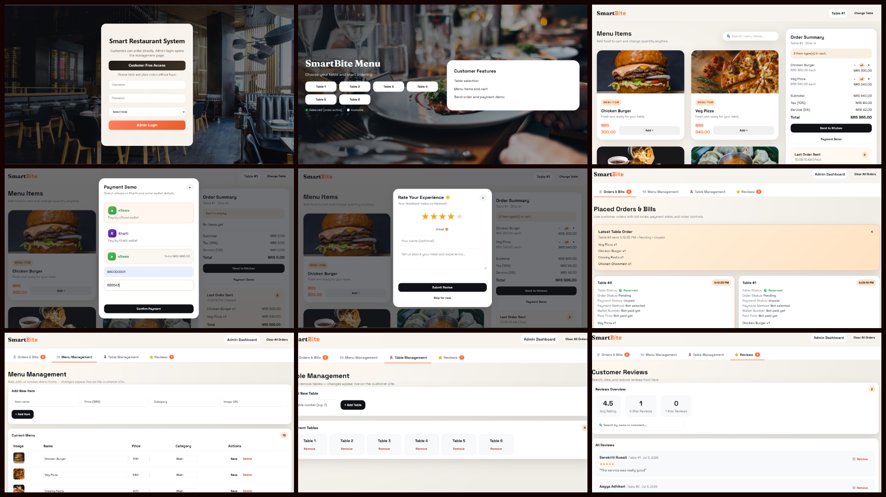

<div align="center">

# 🍽️ SmartBite

### A real-time restaurant ordering and billing system built with vanilla JavaScript & Firebase


[🎮 Live Demo](#) · [🐛 Report Bug](#) · [✨ Request Feature](#)

</div>

---

## 📸 Preview

<div align="center">
  
</div>

---

## 📖 About

**SmartBite** is a real-time restaurant ordering and billing system designed to streamline table-side ordering, kitchen coordination, and billing for small to medium restaurants. It replaces manual order-taking with a synced digital workflow across devices, powered by Firebase Realtime Database.

Built as a final year academic project, it demonstrates real-time data sync, role-based dashboards, and a complete order-to-bill lifecycle without relying on a heavy backend framework.

---

## ✨ Features

- 🪑 **Table-wise ordering** — assign and manage orders per table
- ⚡ **Real-time sync** — updates reflect instantly across all connected devices via Firebase
- 🧾 **Automated billing** — generates itemized bills as orders are placed and updated
- 📋 **Tabbed admin dashboard** covering:
  - Orders — live order tracking and status updates
  - Menu — add, edit, and manage menu items
  - Tables — table status and assignment
  - Reviews — customer feedback overview
- 📱 **Responsive UI** — usable across desktop and mobile devices
- 🔄 **No manual refresh needed** — changes propagate live via Firebase listeners

---

## 🛠️ Tech Stack

| Layer              | Technology                 |
| ------------------ | -------------------------- |
| Structure          | HTML5                      |
| Styling            | CSS3                       |
| Logic              | JavaScript (Vanilla)       |
| Real-time Database | Firebase Realtime Database |

---

## 🚀 Getting Started

### Prerequisites

- A [Firebase](https://firebase.google.com/) project with Realtime Database enabled
- A modern web browser

### Run it locally

```bash
# Clone the repository
git clone https://github.com/namita430/smartbite.git

# Navigate into the project folder
cd smartbite

# Open index.html in your browser
# (Live Server extension in VS Code recommended for local testing)
```

> ⚙️ Make sure to add your own Firebase config (`apiKey`, `projectId`, etc.) in the relevant JS file before running the app locally.

---

## 🗂️ Project Structure

```
smartbite/
├── index.html          # Customer-facing ordering page
├── admin.html          # Admin dashboard
├── css/                # Stylesheets
├── js/
│   ├── firebase-config.js   # Firebase initialization
│   ├── orders.js
│   ├── menu.js
│   ├── tables.js
│   └── reviews.js
└── README.md
```

---

## 🎯 How It Works

1. Customers or staff place orders through the ordering interface
2. Orders sync instantly to Firebase Realtime Database
3. The admin dashboard reflects new orders, table status, and menu changes live — no refresh needed
4. Bills are generated automatically based on order items and quantities
5. Admins can manage the menu, monitor tables, and view customer reviews from a single dashboard

---

## 📚 Academic Deliverables

This project was developed as part of final-year academic requirement at Tribhuvan University, including:

- 📄 Full project report with system analysis and design
- 🗺️ ER diagram & system architecture diagram
- 📊 Gantt chart for project timeline
- 🖥️ Sequence and activity diagrams
- 🎞️ Project presentation slides

---

## 🔮 Future Improvements

- [ ] Online payment integration (eSewa / Khalti)
- [ ] Customer login & order history
- [ ] Kitchen display system (KDS) view
- [ ] Analytics dashboard for sales trends
- [ ] Multi-branch support

---

## 👩‍💻 Author

**Namita Giri**
B.Sc. CSIT, Tribhuvan University

[GitHub](https://github.com/namita430) · [LinkedIn](#)

---

<div align="center">

⭐ If you like this project, consider giving it a star!

</div>
